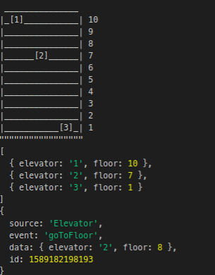

# elevators
Simulating elevators

## Purpose

- Learn TypeScript
- Simulate elevators service, given a number of floors X elevators

## How to use

- Install [Node 13 and NPM](https://nodejs.org/en/download/)

- Clone
```bash
git clone https://github.com/jotafeldmann/elevators
```

- Install
```bash
make install
```

- Run (dev mode, watch changes and reload)
```bash
make
```

## Preview



## Roadmap

- [x] [TypeScript setup](https://www.typescriptlang.org/docs/handbook)
- [x] Request elevator at floors
- [x] Add watch changes and reload task
- [x] Add event controller
- [x] Add basic visual interface
- [x] Add continuous flow of requests
- [ ] Add tests to basic classes
- [ ] Add simulation cases results
- [ ] Request floors from elevators (`building.requestElevatorAtFloor().then(e => e.requestFloor(5))`)
- [ ] Limit and control number of people inside elevators
- [ ] Add different rules for elevators (e.g. elevator 2 only receive requests from last floors)
- [ ] Prediction (AI?) max efficiency
